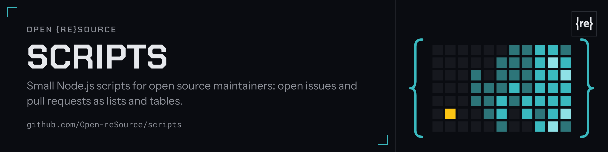

<picture><source srcset=".github/header.svg" type="image/svg+xml"></picture>

# Scripts

Collection of useful scripts linked to open source.

## Usage

- [`node scripts/open-pull-requests-list-to-text-file.js`](scripts/open-pull-requests-list-to-text-file.js) - This script fetches all open pull requests from a GitHub repository and saves them to a text file.
- [`node scripts/open-pull-requests-list-to-markdown-table.js`](scripts/open-pull-requests-list-to-markdown-table.js) - This script fetches all open pull requests from a GitHub repository and saves them to a Markdown table in a Markdown file.
- [`node scripts/open-issues-list-to-markdown-table.js`](scripts/open-issues-list-to-markdown-table.js) - This script fetches all open issues from a GitHub repository and saves them to a Markdown table in a Markdown file.

## Sponsors of Open {re}Source

  

The Open {re}Source mark and the header image (`.github/header.*`) are not covered by the licence of this repository: all rights reserved.
